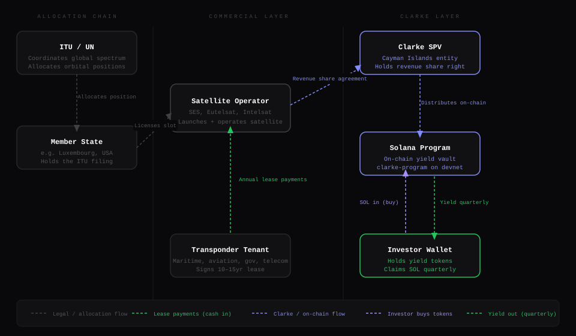

# Clarke

> **Under construction.** This project is actively being developed and is not production-ready.

**The data and intelligence layer for orbital infrastructure.**

Clarke normalizes public data across GEO, LEO, and MEO to build the orbital asset registry, pricing intelligence, and coordination layer the space economy is missing.

---



## What it is

- **Orbital registry** — a searchable, filterable, exportable explorer over every tracked GEO position, built from ITU, FCC, Space-Track, UCS, and SEC public data
- **Intelligence layer** — a heuristic valuation model (value range + confidence + factor breakdown), a normalized 0–100 congestion / coordination-risk score, and per-source data-freshness tracking
- **Agent access** — a versioned read-only HTTP API and an MCP server expose the registry to LLM agents and tools
- **Company directory** — 170+ companies across the space infrastructure stack indexed by sector
- **Blog** — long-form writing on orbital infrastructure, space compute, and the space economy
- **Data sources** — documented public datasets Clarke normalizes

---

## Agents API & MCP

Clarke exposes its registry as machine-readable data for LLM agents and tools.

**HTTP API** — versioned, read-only, rate-limited, CORS-enabled, and ETag-cached. Responses are wrapped in a `{ data, meta }` envelope, where `meta.data_freshness` reports when each source was last ingested.

| Endpoint | Returns |
|---|---|
| `GET /api/v1/agents/slots` | All orbital positions, each with a congestion score and heuristic valuation |
| `GET /api/v1/agents/slots/{slug}` | Full dossier for one slot: co-located satellites, FCC authorizations, congestion + valuation breakdowns |
| `GET /api/v1/agents/satellites` | GEO satellites (filter by `operator`, `ownerCountry`, `limit`) |
| `GET /api/v1/agents/companies` | Company registry (filter by `sector`) |
| `GET /api/v1/agents/companies/{slug}` | Company profile with stock, slots, and satellites cross-referenced |

**MCP server** — the same registry as tools for Claude Code, Cursor, and other MCP clients:

```bash
npm run mcp
```

Tools: `clarke_list_slots`, `clarke_get_slot`, `clarke_list_satellites`, `clarke_list_companies`, `clarke_get_company`, `clarke_company_sectors`, `clarke_list_stocks`. See the header of `scripts/clarke-mcp.ts` for a sample client config.

---

## Data pipeline

The registry is backed by a SQLite database (`data/clarke.db`) that ships committed, so the app runs out of the box. To rebuild it from source:

```bash
npm run ingest            # UCS Satellite Database (GEO subset)
npm run ingest:fcc        # FCC Approved Space Station List (from data/ssal.xlsx)
npm run ingest:spacetrack # Space-Track satcat + TLEs (requires credentials)
npm run ingest:all        # all of the above
```

Each run records its timestamp and row count in an `ingest_meta` table, surfaced on the `/data` page and in the API's `meta.data_freshness`.

---

## Stack

- **Frontend:** Next.js 16, Tailwind CSS 4, Manrope + IBM Plex Mono
- **Database:** SQLite via `better-sqlite3`
- **Agent interface:** versioned REST API + MCP server (`@modelcontextprotocol/sdk`)
- **Data:** Yahoo Finance (stock quotes), ITU SNS, FCC IBFS, Space-Track, UCS Satellite Database, SEC EDGAR

---

## Running locally

```bash
npm install
npm run dev
```

---

## Environment variables

| Variable | Required | Description |
|---|---|---|
| `NEXT_PUBLIC_URL` | Yes (prod) | Canonical URL |
| `NOTIFY_WEBHOOK_URL` | No | Webhook for form submissions |
| `SPACETRACK_USERNAME` | No | Space-Track login (for `npm run ingest:spacetrack`) |
| `SPACETRACK_PASSWORD` | No | Space-Track password (for `npm run ingest:spacetrack`) |
| `PV_SECRET` | No | Secret to read the internal page-view counter at `/api/pv` |
| `NEXT_PUBLIC_PLAUSIBLE_DOMAIN` | No | Plausible analytics domain |

---

## License

MIT
